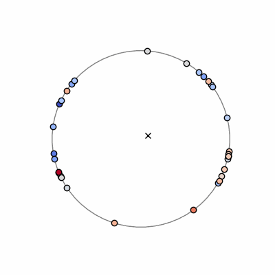

# kuramoto_model_workshop
In this workshop, you will work through guided jupyter notebooks to create numerical simulations of collective synchronization using the Kuramoto model. You will get to produce animations like the one below! You will also investigate the conditions under which spontaneous synchronization can occurs. For the motivation behind this workshop and a more detailed description of this workshop, see `description.pdf`.

## How to use these notebooks
The notebooks `part1.ipynb` and `part2.ipynb` contain the content of a challenge question that was developed for the 2023 Winter Workshop of the [GRAD-MAP program](https://www.umdgradmap.org). The workshop aimed to be a week-long exploration in nonlinear dynamics for undergraduate students with limited previous Python and coding experience.

Both notebooks work participants through the steps needed to simulate the Kuramoto model in Python and produce animations like the one above. Structured and blank cells are included for participants to insert their own code and reflect on the results that they observe. Further instructions can be found at the top of `part1.ipynb`.

To use these notebooks, you must be able to run a jupyter notebook with the python packages `numpy` and `matplotlib`. This can be accomplished by installing `conda` package manager.

## More info
This challenge question is inspired by L Q English 2008 Eur. J. Phys. 29 143.
